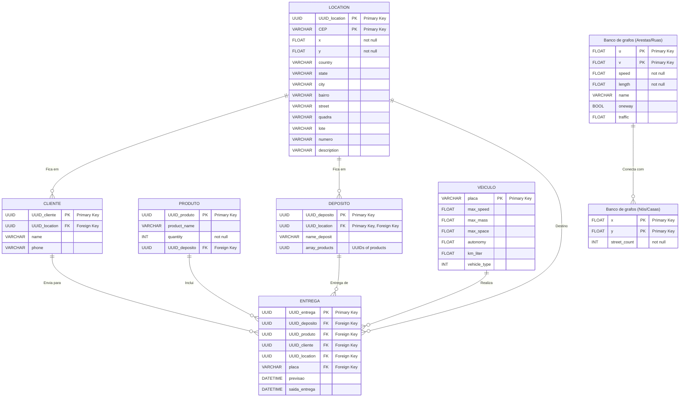

# Roteamento de Veículos

### [Main](#roteamento-de-veiculos) | [Installation](#installation) | [Architecture](#architecture) | [Contributors](#contributors) | [Licence](#licence)

Trabalho final de Algoritmos e Estruturas de Dados 2 voltado para o roteamento de veículos.


## Sobre o Problema

O problema de roteamento de veículos (VRP - Vehicle Routing Problem) é um dos desafios mais significativos na área de logística e transporte. Ele envolve a determinação das rotas mais eficientes para um conjunto de veículos que devem realizar entregas ou serviços em diversos locais. O objetivo principal é minimizar o custo total, que pode incluir a distância percorrida, o tempo de viagem ou o consumo de combustível, enquanto se atende a todas as restrições operacionais, como capacidade dos veículos e janelas de tempo para as entregas.

### Subvariações do Problema de Roteamento de Veículos

1. **VRP Básico:** Otimização das rotas de veículos sem nenhuma restrição adicional, focando apenas na minimização da distância total percorrida.
2. **VRP com Janelas de Tempo (VRPTW):** As entregas devem ser feitas dentro de intervalos de tempo específicos para cada local.
3. **VRP com Capacidades (CVRP):** Considera a capacidade limitada de carga dos veículos.
4. **VRP com Múltiplos Depósitos (MDVRP):** Envolve múltiplos pontos de partida e chegada para os veículos.
5. **VRP com Frota Heterogênea:** Considera veículos com diferentes capacidades e custos operacionais.
6. **Problema do Caixeiro Viajante (TSP):** Um caso especial do VRP, onde um único veículo deve visitar todos os locais exatamente uma vez e retornar ao ponto de partida.

## Ferramentas Utilizadas

- **OpenStreetMap:** Fonte de dados geográficos.
- **Ortools:** Ferramenta de otimização do Google para resolver problemas combinatórios, incluindo VRP.
- **NetworkX:** Biblioteca Python para a criação, manipulação e estudo da estrutura, dinâmica e funções de grafos complexos.
- **Folium:** Biblioteca Python para visualização de dados geoespaciais.
- **Streamlit:** Ferramenta de compartilhamento de dados que facilita a criação de aplicações web interativas.
- **Neo4j:** Banco de dados de grafos.
- **PostgreSQL:** Banco de dados relacional.

## Installation

Siga estes passos para instalar corretamente e contribuir:

```bash
python3 -m venv <name_you_want> # Criar ambiente virtual

git clone https://github.com/guilhermefrazao/AED2_roteamento_de_veiculos.git # Clonar repositório

source <name_you_want>/bin/activate # Ativar ambiente virtual

cd AED2_roteamento_de_veiculos

pip install -r requirements.txt # Instalar dependências Python

code . # Abrir VSCode (opcional)
```


Make sure you have Python and Git installed

## Modelagem de Dados
### Modelagem do Banco de Dados Relacional (PostgreSQL)



## Info, Links and Others:

### Architecture

    .
    ├── code        #code and tests
    ├── docs        # Reports
    ├── entregaai   #streamlit application
    │   └── static
    │       ├── images  #images used on streamlit
    │       └── maps    #maps generated
    └── images      #images used
    └── LICENCE.md 
    └── README.md
    └── requirements.txt

### Contributors:

- Carlos Henrique Goncalves Batista
- Guilherme Frazão Fernandes
- Pedro Antonio Maciel Saraiva

### LICENCE: 

**Creative Commons Attribution-NonCommercial (CC BY-NC)**

You can see the licence [here](https://www.creativecommons.org/licenses/by-nc/4.0/deed.en)