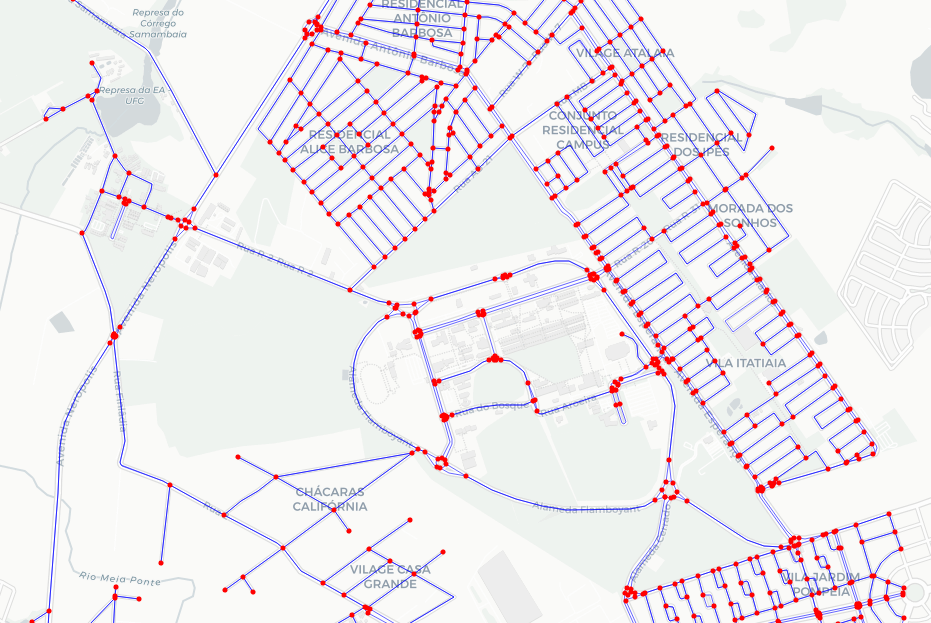

   
# Roteamento de Veiculos

### [Main](#roteamento-de-veiculos) | [Installation](#installation) | [Others](#info-links-and-others)

Trabalho final de Algoritmos e Estruturas de dados 2 voltado para o roteamento de veiculos

Sobre o problema, resume-se em achar melhores rotas para unicos ou multiplos veiculos de entrega. Isso deve levar em conta o grafo da cidade, os atributos dos veiculos de entrega e os atributos dos produtos, além do tempo de entrega necessario. A ideia de resolucao e tentar achar uma heuristica que resolva

Estamos no momento, na parte de entender as ferramentas relacionadas e como modelar o problema

Ate o momento algumas ferramentas foram encontradas

- OpenSteetMap
- NetworkX(python lib)
- Folium
- DataScince and ML libs
- AWS Neptune(database)
- ArangoDB(database)
- Neo4j(database)

## Installation

Follow this steps for correctly installation and contribution:

    python3 -m venv <name_you_want> #Create venv

    git clone https://github.com/guilhermefrazao/AED2_roteamento_de_veiculos.git #copy repo

    source <name_you_want>/bin/activate #activate venv

    cd <name_you_want>

    pip install -r requirements.txt #install python dependencies

    code . #Open VSCODE(optional)

Make sure you have Python and Git installed

## Info, Links and Others:

### Architecture

    .
    ├── code            #code and tests
    ├── data            #.gitignore - data used on project
    ├── docs            # documentation
    ├── images          # images used
    ├── LICENCE.md
    ├── main.py         # main application
    ├── models          # saved ml models
    ├── README.md
    └── requirements.txt

### Contributors:

- Carlos Henrique Goncalves Batista
- Guilherme Frazão Fernandes
- Pedro Antonio Maciel Saraiva

### LICENCE: 

**Creative Commons Attribution-NonCommercial (CC BY-NC)**

You can see the licence [here](https://www.creativecommons.org/licenses/by-nc/4.0/deed.en)